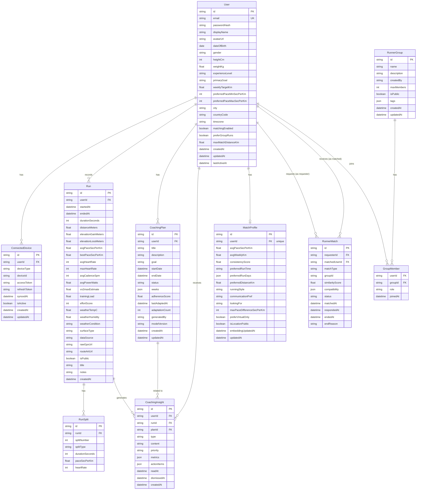

# ERD (Entity Relationship Diagram)

> Mermaid 문법 사용. GitHub / VS Code Mermaid Preview에서 렌더링 가능.

---

## 관계 요약

| 관계 | 설명 |
|------|------|
| `User` → `Run` | 1:N — 유저는 여러 런 기록을 가짐 |
| `User` → `MatchProfile` | 1:1 — 매칭 프로필은 유저당 하나 |
| `User` → `CoachingPlan` | 1:N — 유저는 여러 훈련 계획을 가짐 |
| `User` → `CoachingInsight` | 1:N — 유저는 여러 AI 인사이트를 받음 |
| `User` → `ConnectedDevice` | 1:N — 유저는 여러 기기를 연결 가능 |
| `Run` → `RunSplit` | 1:N — 런은 여러 구간 기록을 가짐 |
| `Run` → `CoachingInsight` | 1:N — 런 완료 시 인사이트 생성 |
| `User` → `RunnerMatch` | 1:N (양방향) — requester / matched 두 FK |
| `RunnerGroup` → `GroupMember` | 1:N — 그룹은 여러 멤버를 가짐 |
| `User` → `GroupMember` | 1:N — 유저는 여러 그룹에 가입 가능 |

---

## 인덱스 전략

| 모델 | 인덱스 | 목적 |
|------|--------|------|
| `User` | `email` | 로그인 조회 |
| `Run` | `(userId, startedAt DESC)` | 런 목록 (메인 쿼리) |
| `Run` | `startedAt` | 기간 필터 |
| `ConnectedDevice` | `userId` | 유저 기기 목록 |
| `CoachingPlan` | `(userId, status)` | 활성 계획 조회 |
| `CoachingInsight` | `(userId, createdAt DESC)` | 인사이트 피드 |
| `CoachingInsight` | `(userId, readAt)` | 읽지 않은 인사이트 |
| `RunnerMatch` | `requesterId`, `matchedUserId` | 매칭 조회 (양방향) |
